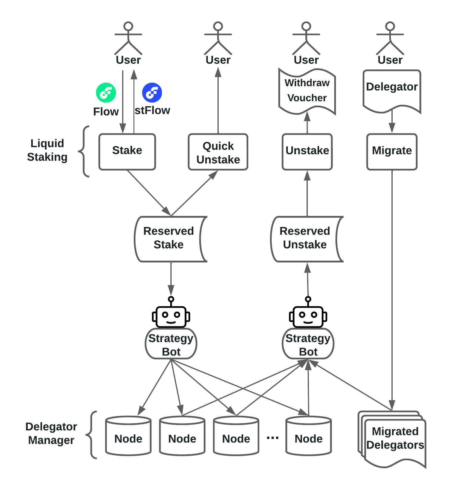

# 💧 Liquid Staking
Liquid Staking Protocol allows users to earn staking rewards without locking $flow tokens or running node softwares. Users can deposit $flow tokens and receive transferrable $stFlow tokens in return. Liquid staking combines the benefits of staking (earning rewards) and brings liquidity, as well as additional possibilities to increase your assets or hedge your positions by participating in Flow’s DeFi ecosystem.
Furthermore, LSP stakes these tokens to a set of different node providers for the sake of decentralization, preventing any single point of failure, diversifying staking risks and stabilizing liquid staking apr.

### Overview

  

### Documentation
* [Liquid Staking Docs](https://docs.increment.fi/protocols/liquid-staking)

### Security
* Audited by [Oak Security](https://www.oaksecurity.io), [report](https://increment-audit.s3.us-west-1.amazonaws.com/Audit+Report+-+IncrementFi+Liquid+Staking.pdf)
* Bug bounty: [rules](https://docs.increment.fi/miscs/bug-bounty)
